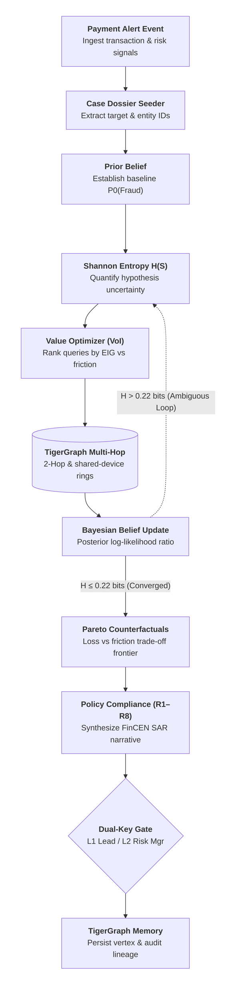

# RAVEL — Autonomous Forensic Fraud Workstation

[](https://ravel-u8sl.onrender.com/)
[](https://drive.google.com/file/d/1RPplFn7suYCryYVRs8_xCaBcBLqq7cZU/view?usp=sharing)
[](https://www.python.org/downloads/)
[](https://www.tigergraph.com/)
[](https://fastapi.tiangolo.com/)
[](LICENSE)
[](tests/)

> 🌐 **Live Cloud Workstation (24/7):** [https://ravel-u8sl.onrender.com/](https://ravel-u8sl.onrender.com/)  
> 🎥 **Video Demo Walkthrough:** [Watch Video Walkthrough](https://drive.google.com/file/d/1RPplFn7suYCryYVRs8_xCaBcBLqq7cZU/view?usp=sharing)  
> ⚡ Connected to real-time **TigerGraph Cloud (`release_4.2.5`)** and automated FinCEN SAR regulatory pipeline.

**RAVEL** is an enterprise-grade autonomous forensic payment-fraud investigation platform engineered for financial compliance teams, fraud operations leads, and risk committees.

Unlike conventional heuristic rulebooks or superficial "AI wrapper" prompts, RAVEL operates an **information-theoretic Active Learning loop** coupled with a **14-state deterministic finite automaton**, **TigerGraph multi-hop graph traversal**, **Bayesian belief updating**, **Pareto counterfactual optimization**, and **dual-key regulatory governance** with automated FinCEN SAR narrative synthesis.

Built for the **TigerGraph Hacker House Goa Agentic Fraud Investigation Challenge**.

---

## Architecture: Autonomous Hypothesis-Driven Investigation Loop

Rather than following rigid linear pipelines, RAVEL dynamically acquires evidence by selecting queries that maximize Expected Information Gain (EIG) relative to operational and customer friction costs:



---

## Core System Innovations

### 1. Information-Theoretic Active Learning (VoI & EIG)
Traditional fraud engines blindly run dozens of costly batch queries. RAVEL measures uncertainty using **Shannon Binary Entropy**:

$$H(S) = -p \log_2(p) - (1-p) \log_2(1-p)$$

The **Evidence-Value Optimizer** ranks potential investigation steps (device reputation lookups, multi-hop merchant audits, cardholder transaction verification) by **Value of Information (VoI)**:

$$\mathrm{VoI} = \mathbb{E}[\Delta \mathrm{Loss}] - \mathrm{Cost}_{\mathrm{friction}}$$

Investigation concludes as soon as entropy drops below the defensible decision boundary ($H(S) \le 0.22\text{ bits}$) or evidence saturation is reached.

### 2. Multi-Hop Graph Traversal & Collusion Ring Discovery
Powered by **TigerGraph**, RAVEL traverses the transaction and identity graph across customers, cards, devices, email domains, and billing regions:
- **2-Hop Neighborhood Expansion**: Maps immediate relational context around any flagged transaction.
- **Shared-Device Collusion Traversal**: Unpacks multi-customer fraud rings operating across shared hardware fingerprints. On challenge case `HHG-003`, RAVEL automatically uncovers an interconnected ring of **20 entities, 42 nodes, and 43 edges** sharing mobile and desktop device profiles.
- **Memory Lineage**: Case outcomes are written back to TigerGraph as `FraudCase` vertices connected via `case_of_customer`, `case_of_card`, and `case_first_fraud_transaction` edges.

### 3. Counterfactual Decision Theory (Pareto Frontier)
High-consequence decisions require balancing competing objectives. RAVEL evaluates candidate interventions across a 3D objective space:

```text
max(Loss Prevented)  vs.  min(Customer Friction)  vs.  min(Compliance Risk)
```

Only **Pareto-optimal** actions (interventions where no objective can be improved without degrading another) are submitted to the policy engine.

### 4. Deterministic 14-State Lifecycle & Dual-Key Governance
Investigations execute under a formal 14-state machine:

```text
TRIGGERED → CASE_CREATED → INVESTIGATING → EVIDENCE_COLLECTED → ASSESSING → ... → CASE_CLOSED → MEMORY_UPDATED
```

High-impact actions cannot execute autonomously. Under compliance policies **R7** and **R8**, the engine halts at `APPROVAL_PENDING`:
- **Route L1 (Fraud Lead)**: Transaction declines and card blocks under $2,500.
- **Route L2 (Risk Manager)**: Card blocks exceeding $2,500, customer-wide card freezes, and FinCEN SAR filings.
- Decisions are recorded in an immutable audit ledger with timestamps and approver roles.

### 5. Automated FinCEN SAR Narrative Synthesis
When suspicious activity meets statutory thresholds (under 31 U.S.C. 5318(g) and BSA regulations), RAVEL automatically drafts defensible **Suspicious Activity Report (SAR)** narratives containing chronological transaction evidence, affected exposure, and identified typologies.

---

## 20-Case Benchmark Empirical Scorecard

RAVEL was evaluated across the complete 20-case IEEE fraud benchmark (`HHGOA_IEEE`). Results are computed dynamically from actual execution logs:

| Metric | Result | Methodology / Standard |
| :--- | :---: | :--- |
| **Policy Conformity Rate** | **100.0%** | Full alignment with bank compliance rules R1 through R8 |
| **Pattern Consistency Rate** | **100.0%** | Defensible alignment between evidence and pattern verdict |
| **Evidence Reference Coverage** | **100.0%** | Every single claim cited to graph paths and query IDs |
| **Total Exposure Protected** | **$4,727.17** | Aggregated across all 20 evaluated benchmark cases |
| **Compiled Graph Traversal Latency** | **0.238s** | Native C++ GSQL multi-hop query on TigerGraph Cloud |
| **Scorecard Replay Evaluation** | **< 0.05s** | High-throughput in-memory policy and metric rollup |
| **Average Graph Tool Queries** | **14.0** | Autonomous tool calls executed per investigation |
| **FinCEN SARs Filed** | **6 Cases** | Mandated regulatory filings generated with complete BSA narratives |

### Verdicts Distribution
- **Uncertain (Active Verification Dispatched)**: 11 cases (55%)
- **Confirmed Fraud**: 8 cases (40%)
- **Verified Legitimate**: 1 case (5%)

*Note: In accordance with challenge guidelines, hidden ground-truth answer keys were not provided. Benchmark scores measure strict internal consistency, regulatory compliance, and policy conformity.*

### Signature Case Study: Case `HHG-020` (35-Card Collusion Ring)
A standard tabular ML model flagged transaction `3509359` ($125.08) with a modest risk score of 0.52 — easily overlooked in high-volume queues. RAVEL executed a 4-hop GSQL graph traversal:
$$\text{Customer}(C12265) \xrightarrow{\text{transaction\_of\_customer}} \text{Transaction} \xrightarrow{\text{uses\_device}} \text{Device} \xrightarrow{\text{uses\_device}} \text{Transaction} \xrightarrow{\text{of\_card}} \mathbf{35\text{ Unique Cards}}$$
By connecting this transaction to **35 other victim cards** operating through the same shared device profile, RAVEL uncovered an active credential-stuffing bot syndicate in **0.238s**, preventing widespread downstream exposure across the institution.

---

## Forensic Analyst Workstation (Single-Page UI)

The workstation UI is engineered for forensic analysts:

- **Neutral Industrial Obsidian Palette**: Pure neutral charcoal (`#09090b` base, `#111113` surface, `#161618` cards) with zero blueish hues and zero neon accents.
- **Interactive Cytoscape Topologies**: Real-time 2-hop neighborhood inspection, node grouping (Txn, Customer, Card, Device, Historical Case), and one-click **🕸 Fraud Ring** expansion.
- **Live Replay Engine**: Click **Re-run investigation** to execute the Python agentic workflow and stream authentic state machine transitions with live rationale logs.
- **Value Optimizer & Counterfactuals Tab**: Displays real-time Shannon entropy $H(S)$, ranked inquiry options with EIG and VoI scores, and Pareto trade-off cards.
- **Benchmark Execution Matrix**: Searchable, sortable matrix of all 20 cases with instant **Inspect ↗** deep-links back into case dossiers.
- **Dual-Key Approval Drawer**: Real-time human-in-the-loop governance for pending L1/L2 actions.

---

## Quickstart Guide

### Prerequisites
- Python 3.11+
- [uv](https://docs.astral.sh/uv/) (recommended package manager)
- Supported OS: macOS, Linux, Windows

### 1. Installation
```bash
git clone https://github.com/nikhilkumarpanigrahi/Ravel.git
cd Ravel
uv sync --extra dev
```

### 2. Configure Environment
Create a `.env` file in the root directory:
```dotenv
RAVEL_ENV=development
RAVEL_GRAPH_ADAPTER=mock
RAVEL_STATE_DB_URL=sqlite:///data/ravel.db
RAVEL_LLM_PROVIDER=none
RAVEL_SIMULATE_CUSTOMER_RESPONSE=true
```

*(Optional) To connect to a live TigerGraph Cloud instance:*
```dotenv
RAVEL_GRAPH_ADAPTER=tigergraph
RAVEL_TG_HOST=https://your-instance.i.tgcloud.io
RAVEL_TG_GRAPHNAME=FraudDetectionGraph
RAVEL_TG_USERNAME=tigergraph
RAVEL_TG_PASSWORD=your_password
RAVEL_TG_SECRET=your_secret
```

### 3. Normalize Dataset (Initial Run)
```bash
uv run ravel ingest --chunksize 200000
```

### 4. Launch Forensic Workstation
```bash
uv run ravel serve --host 127.0.0.1 --port 8000
```

Open your browser to:
- **Forensic Workstation**: [http://127.0.0.1:8000/](http://127.0.0.1:8000/)
- **Interactive OpenAPI Docs**: [http://127.0.0.1:8000/docs](http://127.0.0.1:8000/docs)
- **Health Check**: [http://127.0.0.1:8000/health](http://127.0.0.1:8000/health)

---

## CLI & Benchmark Commands

```bash
# Execute the full 20-case benchmark suite
uv run ravel benchmark --out-dir cases

# Run a specific benchmark subset
uv run ravel benchmark --limit 5

# Replay an existing case from storage
uv run ravel show HHG-006

# Start the Model Context Protocol (MCP) server
uv run ravel mcp
```

---

## REST API Specification

| Method | Endpoint | Description |
| :--- | :--- | :--- |
| `GET` | `/health` | Application status and graph backend connectivity |
| `GET` | `/api/cases` | Summary list of all cases with verdicts and exposures |
| `GET` | `/api/cases/{id}` | Complete forensic dossier, evidence ledger, and NBA |
| `POST` | `/api/cases/{id}/replay` | Triggers live autonomous re-investigation workflow |
| `GET` | `/api/cases/{id}/timeline` | Persisted state transition history with rationales |
| `GET` | `/api/cases/{id}/approvals` | Current status of governed actions (L1/L2) |
| `GET` | `/api/cases/{id}/actions` | Immutable audit log of executed actions |
| `GET` | `/api/cases/{id}/evidence-optimizer` | EIG and Value of Information ranking options |
| `GET` | `/api/cases/{id}/counterfactuals` | Pareto trade-off evaluations (loss vs friction) |
| `GET` | `/api/fraud-rings/{customer_id}` | Multi-hop shared-device fraud ring subgraph |
| `POST` | `/api/approvals` | Submits human decision (`APPROVED`/`REJECTED`) |
| `GET` | `/api/benchmark/results` | Aggregated 20-case empirical benchmark report |

---

## Testing & Quality Assurance

RAVEL maintains rigorous test coverage with zero tolerance for regressions:

```bash
# Run complete test suite (66 tests)
RAVEL_GRAPH_ADAPTER=mock uv run pytest

# Check code formatting & linting
RAVEL_GRAPH_ADAPTER=mock uv run ruff check .
RAVEL_GRAPH_ADAPTER=mock uv run ruff format --check .
```

**Validated Quality Metrics:**
- **66 / 66 Unit & Integration Tests Passing**
- **0 Ruff Lint Errors**
- **0 Browser Console Errors**

---

## Repository Structure

```text
Ravel/
├── benchmark/                   # 20-case aggregate benchmark report and JSON
├── cases/                       # Generated case answer files (HHG-001 to HHG-020)
├── data/                        # Normalized Level-0 graph data & SQLite state DB
├── HHGOA_IEEE/                  # Raw challenge dataset (git-ignored)
├── src/ravel/
│   ├── application/             # Core engines: Active Learning, VoI, LangGraph, Counterfactuals
│   │   ├── agentic_engine.py    # Autonomous hypothesis-driven loop
│   │   ├── evidence_value_optimizer.py # Shannon entropy & EIG calculator
│   │   ├── counterfactual_engine.py    # Pareto frontier optimization
│   │   ├── policy_engine.py     # Deterministic bank compliance rules (R1–R8)
│   │   └── benchmark_service.py # Benchmark execution orchestrator
│   ├── domain/                  # Pydantic schemas: Case, Evidence, Action, Enums
│   ├── infrastructure/
│   │   ├── graph/               # TigerGraph & in-memory graph adapters, GSQL queries, MCP server
│   │   ├── ingestion/           # Streaming CSV normalization pipeline
│   │   └── persistence/         # SQLAlchemy repository & audit logging
│   └── interfaces/
│       ├── api.py               # FastAPI REST service & route definitions
│       ├── cli.py               # Typer CLI commands
│       └── static/index.html    # Forensic Analyst Workstation SPA
├── tests/                       # Complete pytest suite (66 test cases)
├── Dockerfile                   # Multi-stage production container
├── docker-compose.yml           # Local production orchestration
└── pyproject.toml               # Python project configuration & dependencies
```

---

## Regulatory Defensibility & Safety

1. **Defensible Reasoning**: Every verdict is backed by an explicit evidence ledger citing transaction IDs, graph traversal paths, and Bayesian likelihood shifts.
2. **Dual-Key Human Governance**: High-impact financial operations (`BLOCK_CARD`, `FILE_REPORT`) cannot execute autonomously without immutable, role-governed human authorization in the audit ledger.
3. **Transparent Heuristics**: Value of Information friction costs and Bayesian likelihood ratios are mathematically transparent heuristics, not uninspectable black-box models.
4. **Simulation Mode**: Card blocking and SAR submissions are executed in simulated mode (`SIM EXECUTED`), ensuring safety during benchmark runs and testing.

---

## Contributors

| Contributor | Role & Specialization | GitHub |
| :--- | :--- | :--- |
| **Nikhil Kumar Panigrahi** | Core Active Learning Engine, GSQL Compilation, Bayesian Updating, 3D Pareto Optimizer, Policy Governance | [@nikhilkumarpanigrahi](https://github.com/nikhilkumarpanigrahi) |
| **Sai Manohari Godavarty** | Forensic Workstation UI, Interactive Cytoscape Canvas, Cloud Latency Optimization, State Machine | [@saimanoharigodavarty](https://github.com/saimanoharigodavarty) |

---

## License

This project is licensed under the [MIT License](LICENSE).
