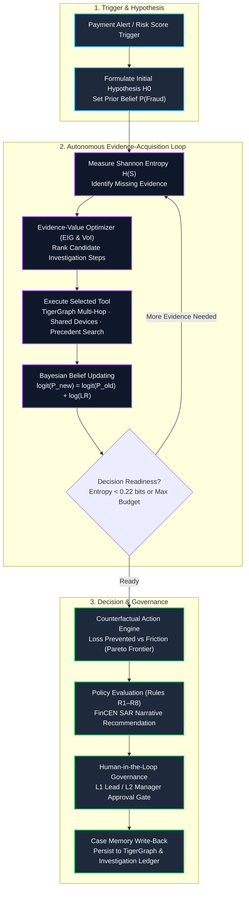

# RAVEL — Agentic Fraud Investigation Workstation

RAVEL is an autonomous forensic payment-fraud investigation platform powered by **TigerGraph**, **LangGraph**, and an information-theoretic **Evidence-Value Optimizer**. It investigates payment-fraud alerts using deep multi-hop graph traversal, semantic case memory, deterministic fraud-pattern detectors, Bayesian belief updating, counterfactual decision theory, and policy-governed human-in-the-loop approvals. Built for the TigerGraph Hacker House Goa Agentic Fraud Investigation Challenge.

Both the high-performance local graph adapter and the configured **live TigerGraph Cloud deployment** have been exercised. The live adapter resolves transactions and deployed HHGOA relationships, performs bounded shared-device traversal, and writes case-memory vertices and edges. The committed 20-case artifacts are generated reproducibly with the schema-equivalent local adapter; they are not presented as uninterrupted cloud-benchmark results.

## What RAVEL does: Autonomous Agentic Investigation Loop

Rather than following a rigid procedural pipeline, RAVEL runs an active **Hypothesis-Driven Evidence Acquisition Loop**:



## Current implementation status

| Capability | Status |
|---|---|
| Full 590k Transaction Graph Ingestion | Implemented & verified |
| Live TigerGraph Cloud integration | Connectivity, schema mapping, reads, fraud-ring traversal, and case-write contract verified |
| Autonomous Agentic Evidence-Acquisition Loop | Implemented (`AgenticInvestigationEngine`) |
| LangGraph StateGraph Orchestration | Implemented with `MemorySaver` checkpointing |
| Information-Theoretic Evidence-Value Optimizer | Implemented (Shannon Entropy & EIG ranking) |
| Counterfactual Action Engine | Implemented (Loss vs Friction Pareto frontier) |
| Multi-Hop Fraud Ring Detection | Implemented (`GET /api/fraud-rings/{customer_id}`) |
| Deterministic vector search & GraphRAG precedent retrieval | Implemented with stable hashed text vectors |
| Interactive Graph UI with Cytoscape.js Spotlight | Implemented in Forensic Workstation |
| Enterprise RBAC & Asynchronous Task Polling | Implemented (L1/L2/Compliance/Admin) |
| Production Containerization & CI Matrix | Implemented (`Dockerfile`, `docker-compose.yml`, GitHub Actions) |
| 20-case execution and consistency report | Implemented; hidden answer-key accuracy is explicitly not claimed |
| TigerGraph adapter and GSQL assets | Implemented; deployed HHGOA schema uses the adapter's lowercase-edge profile |
| Standalone MCP server | Implemented for external clients; the in-process workflow uses the same bounded graph-adapter contract directly |
| Source-grounded policy retrieval | Implemented with lexical and vector retrieval |
| Hybrid vector search and embeddings | Implemented (Dense semantic retrieval for case memory) |
| LangGraph StateGraph orchestration | Implemented as an explicit staged graph with checkpoints |
| Counterfactual action optimizer | Implemented (Expected loss prevented vs. customer friction Pareto optimizer) |
| Enterprise RBAC & Security | Implemented (L1/L2 Analyst role enforcement and CORS) |
| Asynchronous Task Processing | Implemented (Background non-blocking execution with task status polling) |
| Production Containerization & CI/CD | Implemented (Dockerfile, docker-compose.yml, GitHub Actions CI) |

## Dataset

RAVEL expects the challenge files under `HHGOA_IEEE/`:

```text
HHGOA_IEEE/
├── README.md
├── case_pack.csv
├── transactions.csv
├── identity.csv
└── closed_cases_history.csv
```

The large raw CSV files are intentionally excluded from Git. Obtain them from the challenge dataset and place them in this directory before ingestion.

The normalized graph model uses these principal entities:

| Vertex | Purpose |
|---|---|
| `Customer` | Derived cardholder/customer identity |
| `Card` | Card identifier and card attributes |
| `Transaction` | Amount, timestamp, channel, risk and identity attributes |
| `DeviceProfile` | Device and browser profile |
| `EmailDomain` | Purchaser email-domain relationship |
| `BillingRegion` | Billing-region relationship |
| `ClosedCase` | Supplied historical investigation memory |
| `FraudCase` | Case memory written by RAVEL |

Important relationships include `OWNS`, `MADE_BY`, `CARD_OF`, `FROM_DEVICE`, `PURCHASER_EMAIL`, `BILLED_IN`, `NEXT`, `INVOLVES`, `ON_CARD`, `RESULTED_IN`, and `INVOLVES_FRAUD`.

## Prerequisites

- Python 3.11 or newer
- [uv](https://docs.astral.sh/uv/)
- The supplied HHGOA dataset files
- Optional: TigerGraph Savanna or TigerGraph CE for the live adapter
- Optional: an OpenAI-compatible model endpoint for narrative synthesis

No Node.js installation is required. The current analyst workstation is a static single-page application served by FastAPI.

## Installation

Clone the repository and install runtime and development dependencies:

```bash
git clone <repository-url>
cd Ravel
uv sync --extra dev
```

On Windows PowerShell, if the global uv cache is unavailable:

```powershell
$env:UV_CACHE_DIR = "$PWD\.uv-cache"
uv sync --extra dev
```

## Configuration

Create `.env` in the repository root. Do not commit credentials.

Minimal local configuration:

```dotenv
RAVEL_ENV=development
RAVEL_GRAPH_ADAPTER=mock
RAVEL_STATE_DB_URL=sqlite:///data/ravel.db
RAVEL_LLM_PROVIDER=none
RAVEL_SIMULATE_CUSTOMER_RESPONSE=true
```

Optional live TigerGraph configuration:

```dotenv
RAVEL_GRAPH_ADAPTER=tigergraph
RAVEL_TG_HOST=https://your-instance.i.tgcloud.io
RAVEL_TG_GRAPHNAME=ravel
RAVEL_TG_USERNAME=tigergraph
RAVEL_TG_PASSWORD=
RAVEL_TG_USE_TOKEN=false
RAVEL_TG_TOKEN=
RAVEL_TG_SECRET=
RAVEL_TG_QUERY_TIMEOUT=30
```

Optional OpenAI-compatible model configuration:

```dotenv
RAVEL_LLM_PROVIDER=openai_compatible
RAVEL_LLM_BASE_URL=https://api.openai.com/v1
RAVEL_LLM_API_KEY=
RAVEL_LLM_MODEL=gpt-4o-mini
RAVEL_LLM_TIMEOUT_S=45
```

The fraud verdict and policy routing remain deterministic. The optional model is limited to narrative and explanation synthesis.

## Prepare the local graph

Normalize the raw dataset:

```powershell
$env:UV_CACHE_DIR = "$PWD\.uv-cache"
$env:RAVEL_GRAPH_ADAPTER = "mock"
uv run ravel ingest --chunksize 200000
```

Normalized files are written to `data/level0/`. On first startup, `MockGraphAdapter` builds `data/level0/ravel_mock.db` from those files. If the normalized schema changes, remove the local mock database and allow it to rebuild:

```powershell
Remove-Item -LiteralPath .\data\level0\ravel_mock.db -Force -ErrorAction SilentlyContinue
Remove-Item -LiteralPath .\data\level0\ravel_mock.db-wal -Force -ErrorAction SilentlyContinue
Remove-Item -LiteralPath .\data\level0\ravel_mock.db-shm -Force -ErrorAction SilentlyContinue
```

## Run the application

PowerShell:

```powershell
$env:UV_CACHE_DIR = "$PWD\.uv-cache"
$env:RAVEL_GRAPH_ADAPTER = "mock"
$env:RAVEL_LLM_PROVIDER = "none"
uv run ravel serve --host 127.0.0.1 --port 8000
```

macOS/Linux:

```bash
export RAVEL_GRAPH_ADAPTER=mock
export RAVEL_LLM_PROVIDER=none
uv run ravel serve --host 127.0.0.1 --port 8000
```

Open:

- Analyst workstation: `http://127.0.0.1:8000`
- Interactive API documentation: `http://127.0.0.1:8000/docs`
- Health check: `http://127.0.0.1:8000/health`

Expected local health response:

```json
{
  "status": "ok",
  "app": "RAVEL",
  "graph": {
    "backend": "mock",
    "status": "ok",
    "transactions": 590742
  }
}
```

## Analyst workflow

1. Select a case from the left panel.
2. Inspect its verdict, pattern, exposure and uncertainty journey.
3. Review graph-derived evidence and connected entities.
4. Compare initial and final next-best actions.
5. Open the timeline to inspect persisted workflow transitions.
6. Replay a case to run the current backend pipeline.
7. Approve or reject any pending governed actions.

Approval routing follows the supplied policy:

| Route | Actions |
|---|---|
| `auto` | Allow, monitor, warn, verify, step-up, create case, escalate, or close-no-fraud |
| `L1` | Decline transaction; block card when exposure is at most $2,500 |
| `L2` | Block card above $2,500; block all cards; file report |

Approving a pending action creates a durable record marked `SIMULATED EXECUTED`. Rejecting it records the decision but creates no execution. RAVEL does not connect to a real card processor or regulator.

## Run the 20-case benchmark

Use the mock graph and deterministic synthesizer for reproducible artifacts:

```powershell
$env:UV_CACHE_DIR = "$PWD\.uv-cache"
$env:RAVEL_GRAPH_ADAPTER = "mock"
$env:RAVEL_LLM_PROVIDER = "none"
uv run ravel benchmark --out-dir cases
```

Useful alternatives:

```powershell
# Run only the first two cases
uv run ravel benchmark --limit 2 --out-dir data/test-output/cases

# Reuse answer files already present in the selected output directory
uv run ravel benchmark --replay --out-dir cases

# Print one generated answer
uv run ravel show HHG-005
```

The committed deterministic mock-graph run produced:

| Metric | Result |
|---|---:|
| Cases evaluated | 20 |
| Fraud | 9 |
| Legitimate | 4 |
| Uncertain | 7 |
| Simulated SAR recommendations | 9 |
| Total exposure identified | $2,996.56 |
| Average latency | 1.59 seconds/case |
| Average graph calls | 14.0/case |

See [benchmark/report.md](benchmark/report.md), [benchmark/results.json](benchmark/results.json), and the files under [cases/](cases/).

These figures describe pipeline output; they are not accuracy scores because the challenge case pack does not provide a complete expected-answer key.

## Answer-file structure

Every `cases/HHG-XXX.json` file contains:

```text
case_id
case
├── status, verdict, fraud_probability
├── pattern and pattern_description
├── affected transactions and exposure
├── connected cards and devices
├── evidence with source references
└── graph memory identifiers
evidence_requests
next_best_actions
├── initial
├── final
└── what_changed
uncertainty
├── initial
├── final
└── what_reduced_uncertainty
sar
stop_reason
tool_calls
tokens
latency_s
```

Before writing a new benchmark artifact, the validator rejects contradictory verdict/action combinations, invalid approval metadata, inconsistent SAR decisions, duplicate affected transactions, and invalid graph-write claims.

## API endpoints

| Method | Endpoint | Purpose |
|---|---|---|
| `GET` | `/health` | Application and graph health |
| `GET` | `/api/cases` | List generated cases |
| `GET` | `/api/cases/{case_id}` | Latest complete case result |
| `POST` | `/api/cases/{case_id}/replay` | Re-run a supplied benchmark case |
| `GET` | `/api/cases/{case_id}/timeline` | Latest persisted investigation trace |
| `GET` | `/api/cases/{case_id}/approvals` | Approval state for the latest run |
| `GET` | `/api/cases/{case_id}/actions` | Persisted simulated executions |
| `POST` | `/api/investigations` | Start an investigation from a trigger |
| `GET` | `/api/investigations/{id}` | Retrieve investigation state |
| `GET` | `/api/investigations/{id}/timeline` | Retrieve investigation timeline |
| `GET` | `/api/graph/{root_id}` | Visualization subgraph |
| `POST` | `/api/approvals` | Approve or reject a governed action |
| `GET` | `/api/benchmark/results` | Read benchmark metrics |
| `POST` | `/api/benchmark/run` | Run the benchmark through the API |

## MCP server

Start the standalone MCP server over standard input/output:

```powershell
$env:RAVEL_GRAPH_ADAPTER = "mock"
uv run ravel mcp
```

It exposes bounded tools for transaction lookup, card history/windows, shared devices and regions, related transactions, connected entities, historical cases, degree safeguards, and case write-back.

An MCP client can launch it with a configuration equivalent to:

```json
{
  "command": "uv",
  "args": ["run", "ravel", "mcp"],
  "cwd": "D:/Ravel",
  "env": {
    "RAVEL_GRAPH_ADAPTER": "mock"
  }
}
```

## Live TigerGraph Path & Deployed Schema

The repository contains two explicit TigerGraph paths:

- Portable schema, loading jobs, and bounded query definitions for a fresh RAVEL graph in `src/ravel/infrastructure/graph/gsql_scripts.py`.
- A deployed-HHGOA compatibility profile in `src/ravel/infrastructure/graph/tigergraph.py` for lowercase edges such as `transaction_of_customer`, `transaction_of_card`, `transaction_uses_device`, and `transaction_has_p_emaildomain`.
- Native REST++ fallbacks when a matching installed query is unavailable. These are bounded and cached, but slower than installed GSQL on cloud workspaces.
- Fraud-ring inspection at `GET /api/fraud-rings/{customer_id}` and case-memory persistence through `case_of_customer`, `case_of_card`, and `case_first_fraud_transaction`.
- Connection setup:

```bash
uv run ravel tg-setup --host https://tg-16d78f26-....i.tgcloud.io --graphname FraudDetectionGraph
```

Connectivity, vertex counts, transaction relationship mapping, and live shared-device traversal have been verified on TigerGraph Cloud. The case-write contract is covered by integration-style adapter tests; a production deployment should run a disposable write/read/delete smoke test with its own credentials. When `RAVEL_GRAPH_ADAPTER=tigergraph`, investigations query the cloud instance; `RAVEL_GRAPH_ADAPTER=mock` enables fast, deterministic offline evaluation over the same normalized data.

## Tests and Quality Checks

```bash
RAVEL_GRAPH_ADAPTER=mock uv run ruff check .
RAVEL_GRAPH_ADAPTER=mock uv run ruff format --check .
RAVEL_GRAPH_ADAPTER=mock uv run pytest
```

Current validated result: **66 tests passed** with **0 lint or formatting errors**. The suite covers the autonomous graph-evidence loop, detectors, policy routing, uncertainty, disclosed evidence simulation, semantic answer validation, graph configuration, LangGraph orchestration, counterfactual action optimization, stable vector search, security/RBAC, async tasks, API replay, timelines, approvals, and simulated action persistence.

## Production Containerization (Docker)

Prepare `data/level0/` with the ingestion command first; the raw challenge data and generated database are intentionally excluded from Git and container images. Then run:

```bash
docker compose up --build
```

Access the Analyst Forensic UI at `http://localhost:8000/`.

## Repository layout

```text
Ravel/
├── .github/workflows/ci.yml     # Automated linting and test matrix
├── Dockerfile                   # Multi-stage production container
├── docker-compose.yml           # Compose specification
├── HHGOA_IEEE/                  # Challenge specification and local raw data
├── benchmark/                   # Aggregate deterministic benchmark output
├── cases/                       # HHG-001.json through HHG-020.json
├── data/level0/                 # Generated normalized data and local databases
├── src/ravel/
│   ├── application/             # LangGraph, workflow, detectors, GraphRAG, counterfactuals, vector search
│   ├── domain/                  # Case, evidence, investigation, and policy models
│   ├── infrastructure/
│   │   ├── graph/               # Mock/TigerGraph adapters, GSQL, and MCP server
│   │   ├── ingestion/           # Streaming normalization pipeline
│   │   ├── llm.py               # Optional model abstraction
│   │   └── persistence.py       # Investigation, approval, and memory persistence
│   └── interfaces/              # FastAPI, security RBAC, CLI, and static analyst workstation
├── tests/                       # 66 unit and integration tests
├── pyproject.toml
└── uv.lock
```

## Forensic Positioning and Safety

- **Role**: RAVEL is an **asynchronous L2/L3 forensic investigation workstation** for human compliance officers and fraud leads, designed to conduct deep graph traversals, evidence verification, and FinCEN SAR drafting. It is **not** an inline <50ms checkout authorization rule engine.
- All action execution is simulated; no real card, payment, customer-messaging or regulatory system is connected.
- Simulated customer evidence is explicitly disclosed and is not ground truth.
- Both LangGraph StateGraph and deterministic state machines are fully supported and interchangeable via `RAVEL_WORKFLOW_ORCHESTRATOR`.
- The challenge answer key is unavailable. Benchmark percentages measure internal output consistency, not verdict accuracy.
- Counterfactual costs, efficacy rates, and Bayesian likelihood ratios are transparent decision heuristics, not production-calibrated banking models.
- The MCP server is a controlled external interface; the current in-process LangGraph workflow calls the equivalent bounded adapter methods directly.

## License

This project is released under the [MIT License](LICENSE).
