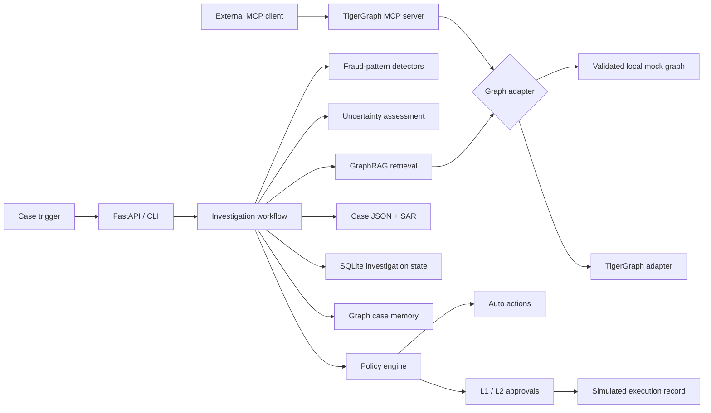

# RAVEL — Agentic Fraud Investigation Workstation

RAVEL investigates payment-fraud alerts using relationship data, historical cases, deterministic fraud-pattern detectors, uncertainty tracking, and policy-governed next-best actions. It was built for the TigerGraph Hacker House Goa agentic fraud investigation challenge.

The repository currently provides a fully runnable local implementation over all 590,742 supplied transactions. It also contains a TigerGraph adapter, GSQL schema/loading/query definitions, and a standalone TigerGraph MCP server. The local mock graph is the validated execution path; live TigerGraph deployment remains an integration path that must be verified against the target Savanna instance before it is presented as production-ready.

## What RAVEL does

For each case in `case_pack.csv`, RAVEL:

1. Resolves the flagged transaction, customer, card, device, region, and historical context.
2. Retrieves related entities and closed-case memory.
3. Runs reusable fraud-pattern detectors over the retrieved evidence.
4. Measures risk, confidence, completeness, contradictions, and missing evidence.
5. Requests additional evidence when policy requires verification.
6. Reassesses the case after the disclosed simulated response.
7. Produces initial and final next-best actions under Fraud Policy v1.0.
8. Routes high-impact actions through L1 or L2 human approval.
9. Generates a case record and, when required, a simulated SAR recommendation.
10. Writes reusable case memory and a persistent investigation trace.

The system does not treat a model risk score as ground truth, and an LLM cannot bypass the deterministic policy layer.

## Architecture



The application workflow currently calls the graph adapter directly. The MCP server is a separate controlled interface for external MCP clients; it is not yet the workflow's internal transport.

## Current implementation status

| Capability | Status |
|---|---|
| Full local dataset ingestion | Implemented and validated |
| SQLite-backed mock graph | Implemented and validated |
| FastAPI backend and analyst UI | Implemented and validated |
| Five reusable fraud-pattern detectors | Implemented |
| Uncertainty and missing-evidence reporting | Implemented |
| Initial/final next-best actions | Implemented |
| L1/L2 approval enforcement | Implemented |
| Persisted simulated action execution | Implemented |
| Twenty answer files and benchmark report | Generated and consistency-validated |
| TigerGraph adapter and GSQL assets | Implemented, live deployment not yet validated |
| Standalone MCP server | Implemented; not yet used internally by the workflow |
| Source-grounded policy retrieval | Implemented with lexical retrieval |
| TigerGraph vector search and embeddings | Not yet implemented |
| LangGraph orchestration | Not yet implemented; current workflow is a deterministic state machine |
| Counterfactual action optimizer | Not yet implemented |

## Dataset

RAVEL expects the challenge files under `HHGOA_IEEE/`:

```text
HHGOA_IEEE/
├── README.md
├── case_pack.csv
├── transactions.csv
├── identity.csv
└── closed_cases_history.csv
```

The large raw CSV files are intentionally excluded from Git. Obtain them from the challenge dataset and place them in this directory before ingestion.

The normalized graph model uses these principal entities:

| Vertex | Purpose |
|---|---|
| `Customer` | Derived cardholder/customer identity |
| `Card` | Card identifier and card attributes |
| `Transaction` | Amount, timestamp, channel, risk and identity attributes |
| `DeviceProfile` | Device and browser profile |
| `EmailDomain` | Purchaser email-domain relationship |
| `BillingRegion` | Billing-region relationship |
| `ClosedCase` | Supplied historical investigation memory |
| `FraudCase` | Case memory written by RAVEL |

Important relationships include `OWNS`, `MADE_BY`, `CARD_OF`, `FROM_DEVICE`, `PURCHASER_EMAIL`, `BILLED_IN`, `NEXT`, `INVOLVES`, `ON_CARD`, `RESULTED_IN`, and `INVOLVES_FRAUD`.

## Prerequisites

- Python 3.11 or newer
- [uv](https://docs.astral.sh/uv/)
- The supplied HHGOA dataset files
- Optional: TigerGraph Savanna or TigerGraph CE for the live adapter
- Optional: an OpenAI-compatible model endpoint for narrative synthesis

No Node.js installation is required. The current analyst workstation is a static single-page application served by FastAPI.

## Installation

Clone the repository and install runtime and development dependencies:

```bash
git clone <repository-url>
cd Ravel
uv sync --extra dev
```

On Windows PowerShell, if the global uv cache is unavailable:

```powershell
$env:UV_CACHE_DIR = "$PWD\.uv-cache"
uv sync --extra dev
```

## Configuration

Create `.env` in the repository root. Do not commit credentials.

Minimal local configuration:

```dotenv
RAVEL_ENV=development
RAVEL_GRAPH_ADAPTER=mock
RAVEL_STATE_DB_URL=sqlite:///data/ravel.db
RAVEL_LLM_PROVIDER=none
RAVEL_SIMULATE_CUSTOMER_RESPONSE=true
```

Optional live TigerGraph configuration:

```dotenv
RAVEL_GRAPH_ADAPTER=tigergraph
RAVEL_TG_HOST=https://your-instance.i.tgcloud.io
RAVEL_TG_GRAPHNAME=ravel
RAVEL_TG_USERNAME=tigergraph
RAVEL_TG_PASSWORD=
RAVEL_TG_USE_TOKEN=false
RAVEL_TG_TOKEN=
RAVEL_TG_SECRET=
RAVEL_TG_QUERY_TIMEOUT=30
```

Optional OpenAI-compatible model configuration:

```dotenv
RAVEL_LLM_PROVIDER=openai_compatible
RAVEL_LLM_BASE_URL=https://api.openai.com/v1
RAVEL_LLM_API_KEY=
RAVEL_LLM_MODEL=gpt-4o-mini
RAVEL_LLM_TIMEOUT_S=45
```

The fraud verdict and policy routing remain deterministic. The optional model is limited to narrative and explanation synthesis.

## Prepare the local graph

Normalize the raw dataset:

```powershell
$env:UV_CACHE_DIR = "$PWD\.uv-cache"
$env:RAVEL_GRAPH_ADAPTER = "mock"
uv run ravel ingest --chunksize 200000
```

Normalized files are written to `data/level0/`. On first startup, `MockGraphAdapter` builds `data/level0/ravel_mock.db` from those files. If the normalized schema changes, remove the local mock database and allow it to rebuild:

```powershell
Remove-Item -LiteralPath .\data\level0\ravel_mock.db -Force -ErrorAction SilentlyContinue
Remove-Item -LiteralPath .\data\level0\ravel_mock.db-wal -Force -ErrorAction SilentlyContinue
Remove-Item -LiteralPath .\data\level0\ravel_mock.db-shm -Force -ErrorAction SilentlyContinue
```

## Run the application

PowerShell:

```powershell
$env:UV_CACHE_DIR = "$PWD\.uv-cache"
$env:RAVEL_GRAPH_ADAPTER = "mock"
$env:RAVEL_LLM_PROVIDER = "none"
uv run ravel serve --host 127.0.0.1 --port 8000
```

macOS/Linux:

```bash
export RAVEL_GRAPH_ADAPTER=mock
export RAVEL_LLM_PROVIDER=none
uv run ravel serve --host 127.0.0.1 --port 8000
```

Open:

- Analyst workstation: `http://127.0.0.1:8000`
- Interactive API documentation: `http://127.0.0.1:8000/docs`
- Health check: `http://127.0.0.1:8000/health`

Expected local health response:

```json
{
  "status": "ok",
  "app": "RAVEL",
  "graph": {
    "backend": "mock",
    "status": "ok",
    "transactions": 590742
  }
}
```

## Analyst workflow

1. Select a case from the left panel.
2. Inspect its verdict, pattern, exposure and uncertainty journey.
3. Review graph-derived evidence and connected entities.
4. Compare initial and final next-best actions.
5. Open the timeline to inspect persisted workflow transitions.
6. Replay a case to run the current backend pipeline.
7. Approve or reject any pending governed actions.

Approval routing follows the supplied policy:

| Route | Actions |
|---|---|
| `auto` | Allow, monitor, warn, verify, step-up, create case, escalate, or close-no-fraud |
| `L1` | Decline transaction; block card when exposure is at most $2,500 |
| `L2` | Block card above $2,500; block all cards; file report |

Approving a pending action creates a durable record marked `SIMULATED EXECUTED`. Rejecting it records the decision but creates no execution. RAVEL does not connect to a real card processor or regulator.

## Run the 20-case benchmark

Use the mock graph and deterministic synthesizer for reproducible artifacts:

```powershell
$env:UV_CACHE_DIR = "$PWD\.uv-cache"
$env:RAVEL_GRAPH_ADAPTER = "mock"
$env:RAVEL_LLM_PROVIDER = "none"
uv run ravel benchmark --out-dir cases
```

Useful alternatives:

```powershell
# Run only the first two cases
uv run ravel benchmark --limit 2 --out-dir data/test-output/cases

# Reuse answer files already present in the selected output directory
uv run ravel benchmark --replay --out-dir cases

# Print one generated answer
uv run ravel show HHG-005
```

The committed deterministic mock-graph run produced:

| Metric | Result |
|---|---:|
| Cases evaluated | 20 |
| Fraud | 9 |
| Legitimate | 4 |
| Uncertain | 7 |
| Simulated SAR recommendations | 9 |
| Total exposure identified | $2,996.56 |
| Average latency | 1.59 seconds/case |
| Average graph calls | 14.0/case |

See [benchmark/report.md](benchmark/report.md), [benchmark/results.json](benchmark/results.json), and the files under [cases/](cases/).

These figures describe pipeline output; they are not accuracy scores because the challenge case pack does not provide a complete expected-answer key.

## Answer-file structure

Every `cases/HHG-XXX.json` file contains:

```text
case_id
case
├── status, verdict, fraud_probability
├── pattern and pattern_description
├── affected transactions and exposure
├── connected cards and devices
├── evidence with source references
└── graph memory identifiers
evidence_requests
next_best_actions
├── initial
├── final
└── what_changed
uncertainty
├── initial
├── final
└── what_reduced_uncertainty
sar
stop_reason
tool_calls
tokens
latency_s
```

Before writing a new benchmark artifact, the validator rejects contradictory verdict/action combinations, invalid approval metadata, inconsistent SAR decisions, duplicate affected transactions, and invalid graph-write claims.

## API endpoints

| Method | Endpoint | Purpose |
|---|---|---|
| `GET` | `/health` | Application and graph health |
| `GET` | `/api/cases` | List generated cases |
| `GET` | `/api/cases/{case_id}` | Latest complete case result |
| `POST` | `/api/cases/{case_id}/replay` | Re-run a supplied benchmark case |
| `GET` | `/api/cases/{case_id}/timeline` | Latest persisted investigation trace |
| `GET` | `/api/cases/{case_id}/approvals` | Approval state for the latest run |
| `GET` | `/api/cases/{case_id}/actions` | Persisted simulated executions |
| `POST` | `/api/investigations` | Start an investigation from a trigger |
| `GET` | `/api/investigations/{id}` | Retrieve investigation state |
| `GET` | `/api/investigations/{id}/timeline` | Retrieve investigation timeline |
| `GET` | `/api/graph/{root_id}` | Visualization subgraph |
| `POST` | `/api/approvals` | Approve or reject a governed action |
| `GET` | `/api/benchmark/results` | Read benchmark metrics |
| `POST` | `/api/benchmark/run` | Run the benchmark through the API |

## MCP server

Start the standalone MCP server over standard input/output:

```powershell
$env:RAVEL_GRAPH_ADAPTER = "mock"
uv run ravel mcp
```

It exposes bounded tools for transaction lookup, card history/windows, shared devices and regions, related transactions, connected entities, historical cases, degree safeguards, and case write-back.

An MCP client can launch it with a configuration equivalent to:

```json
{
  "command": "uv",
  "args": ["run", "ravel", "mcp"],
  "cwd": "D:/Ravel",
  "env": {
    "RAVEL_GRAPH_ADAPTER": "mock"
  }
}
```

## Live TigerGraph path

The repository contains:

- Schema, loading jobs and installed-query definitions in `src/ravel/infrastructure/graph/gsql_scripts.py`
- A pyTigerGraph adapter in `src/ravel/infrastructure/graph/tigergraph.py`
- Normalized loading artifacts under `data/level0/`
- A setup command:

```powershell
uv run ravel tg-setup --host https://your-instance.i.tgcloud.io --graphname ravel
```

The live path is not part of the validated benchmark above. Before using it in a demo or submission, compile the GSQL against the target TigerGraph version, load all files, verify vertex/edge counts, execute every installed query, and confirm case write-back. If a configured live instance fails its health check, the application logs the failure and falls back to the mock adapter.

## Tests and quality checks

```powershell
$env:UV_CACHE_DIR = "$PWD\.uv-cache"
$env:RAVEL_GRAPH_ADAPTER = "mock"
$env:RAVEL_LLM_PROVIDER = "none"
uv run ruff check src tests
uv run pytest -q -p no:cacheprovider
```

Current validated result: **35 tests passed**. The suite covers detectors, policy routing, uncertainty, evidence simulation, answer validation, graph configuration, workflow behavior, API replay, timelines, approvals, and simulated action persistence.

The test suite validates the mock-backed application. It does not currently constitute a live TigerGraph, MCP-client, vector-search, or LangGraph integration test.

## Repository layout

```text
Ravel/
├── HHGOA_IEEE/                  # Challenge specification and local raw data
├── benchmark/                   # Aggregate deterministic benchmark output
├── cases/                       # HHG-001.json through HHG-020.json
├── data/level0/                 # Generated normalized data and local databases
├── src/ravel/
│   ├── application/             # Workflow, detectors, GraphRAG, policy, uncertainty
│   ├── domain/                  # Case, evidence, investigation and policy models
│   ├── infrastructure/
│   │   ├── graph/               # Mock/TigerGraph adapters, GSQL and MCP server
│   │   ├── ingestion/           # Streaming normalization pipeline
│   │   ├── llm.py               # Optional model abstraction
│   │   └── persistence.py       # Investigation, approval and memory persistence
│   └── interfaces/              # FastAPI, CLI and static analyst workstation
├── tests/                       # Unit and integration tests
├── pyproject.toml
└── uv.lock
```

## Safety and limitations

- All action execution is simulated; no real card, payment, customer-messaging or regulatory system is connected.
- Simulated customer evidence is explicitly disclosed and is not ground truth.
- The current benchmark is deterministic and mock-backed.
- Live TigerGraph/GSQL requires environment-specific validation.
- MCP exists as a standalone server but is not yet the internal workflow transport.
- Policy retrieval is source-grounded lexical retrieval, not vector search.
- The workflow is a persisted deterministic state machine, not LangGraph.
- Benchmark distributions are not equivalent to measured accuracy without a trusted answer key.

## License

This project is released under the [MIT License](LICENSE).
